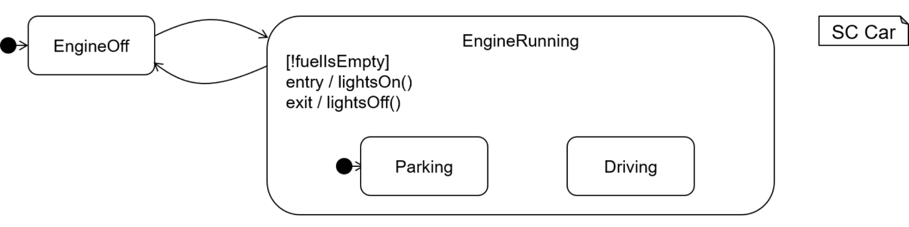

<!-- (c) https://github.com/MontiCore/monticore -->

> NOTE: <br>
This documentation is intended for  **modelers** who use the Statecharts languages.
The documentation for **language engineers** using or extending the Statecharts language is
located **[here](src/main/grammars/de/monticore/Statecharts.md)**.

# Statechart Language in MontiCore

[[_TOC_]]

Statecharts are a comfortable language to describe behavior based on
the internal state of a component. Statecharts have originally been
invented and described in [Harel'87] and were given a sound semantical
basis. They extend automata theory in various forms, including
hierarchy, actions, etc. Statecharts are the foundational behavior
description during which for modelling standards, such as UML and
SysML.

Dependent on the application domain, several forms of Statecharts are
needed for example to accommodate stimuli in form of method calls,
incoming values (signals) or only preconditions that trigger certain
forms of actions.

## Project Structure
* [**doc**](doc) contains images used for the documentation of the language
* [**src/test/resources/examples**](src/test/resources/examples) contains exemplary
  Statecharts models
* [**src/main/grammars**](src/main/grammars) contains language components provided
  for statecharts
* detailed [**language description**](src/main/grammars/de/monticore/Statecharts.md)
  for language developers

## Textual Syntax 

Here is a small teaser for the UML Statechart language, which allows a
method call as stimulus, Java expressions as constraints and Java
blocks/statements as actions:

```
statechart Door {
  state Opened [9 < now < 18];  // state with invariant
  initial state Closed;
  state Locked;
                                // transitions 
  Opened -> Closed  close() ;
  Closed -> Opened  open()    / { count++; ringTheDoorBell(); };
  Closed -> Locked  timeOut() / lockDoor(); ;
  Locked -> Closed  [isAuthorized() && keyFits()] unlock() ;
}
```

This example models the three states of a door: `Opened`, `Closed`, and `Locked`
and four transitions (each terminated by `;`).
- States may be marked with `initial` and `final`.
- A *transition* is defined by `source -> target` states,
  a *stimulus*, such as a method call `close()`,
  a *trigger condition* `[...]`, and an action `/ ...`.
- *Expressions* can be used for *conditions*, and *statements*
  respectively blocks `{...}`
  for the *actions*.

Further language concepts of the UML Statechart are shown in the following
example, where state
`EngineRunning` has two substates as well as *entry*, *exit* *actions*
and an *invariant*:

<a name="example2"></a>
``` 
statechart Car {
  initial state EngineOff;
  state EngineRunning [!fuelIsEmpty] {  // state with substates and state invariant (Boolean expression)
    entry / {lightsOn(); }              // entry / exit action
    exit  / {lightsOff();}
    initial state Parking;              // substates
    state Driving;
  };
}
```

Expressions and statements are taken from MontiCores basic grammar library
and can be extended by any own interesting language constructs
(such as sending or receiving messages `!m` or `?m`)

Further example models such as [`Door.sc`](src/test/resources/examples/uml/Door.sc) or [`Car.sc`](src/test/resources/examples/uml/Car.sc) can be found here:
[src/test/resources/examples](src/test/resources/examples).

Graphical representations of the examples above:

<div align="center">  <br><b>Figure 2:</b> Graphical Representation of the Door Statechart. </div><br> 

<div align="center">  <br><b>Figure 3:</b> Graphical Representation of the Car Statechart. </div><br> 

## Tool Download
* [**Download UML Statecharts Tool**](http://www.monticore.de/download/StatechartsCLI.jar)

Alternatively, the tools can be built from source code.

## Build the Tools
This section explains how to build and set up the command line interface tools
for the SC languages from the source code of the tool. Alternatively, the
tool can be [downloaded](#Tool-Download).

##### Prerequisites
To build the project, it is required to install a Java 8 JDK and git.

##### Step 1: Clone Project with git

    git clone <link to this Git repository>
    cd sc-language

##### Step 2: Build Project with gradle

    gradle build --refresh-dependencies
Afterwards, the jar of the tool is available in `sc-language/target/libs`.

## Tool Documentation

The [StatechartsCLI](src/main/java/de/monticore/StatechartsCLI.java) offers the CLI for processing Statechart models.
It provides through the CLI as follows:

`java -jar StatechartsCLI.jar [-h] -i <fileName> [-path <p>] [-pp [<file>]] [-s [<file>]]`

where the arguments are:

| Option                     | Explanation |
| ------                     | ------ |
| `-h,--help`                | Prints this help information   |
| `-i,--input <file>`        | Reads the source file (mandatory) and parses the contents as a statechart |
| `-pp,--prettyprint <file>` | Prints the Statechart-AST to stdout or the specified file (optional) |
| `-path`                     | Sets the artifact path for imported symbols, space separated |
| `-r,--report <dir>`        | Prints reports of the statechart artifact to the specified directory. This includes e.g. reachable states and branching degrees  |
| `-s,--symboltable <file>`  | Stores the symbol table of the given Statechart |

exemplary usage:

```
  java -jar StatechartsCLI.jar -h
  java -jar StatechartsCLI.jar -i Car.sc -pp
``` 

## Contribute

Please make sure that 
* your complete workspace only uses UNIX line endings (**LF**)
* all files are **UTF-8 without BOM** and
* you use **2 spaces** indentation for all files (**no tabs**)
* On Windows: configure git to **not automatically replace LF with CRLF** during checkout:  
      `git config --global core.autocrlf input`

## Further Information

* [Project root: MontiCore @github](https://github.com/MontiCore/monticore)
* [MontiCore documentation](http://www.monticore.de/)
* [**List of languages**](https://github.com/MontiCore/monticore/blob/dev/docs/Languages.md)
* [**MontiCore Core Grammar Library**](https://github.com/MontiCore/monticore/blob/dev/monticore-grammar/src/main/grammars/de/monticore/Grammars.md)
* [Best Practices](https://github.com/MontiCore/monticore/blob/dev/docs/BestPractices.md)
* [Publications about MBSE and MontiCore](https://www.se-rwth.de/publications/)
* [Licence definition](https://github.com/MontiCore/monticore/blob/master/00.org/Licenses/LICENSE-MONTICORE-3-LEVEL.md)

