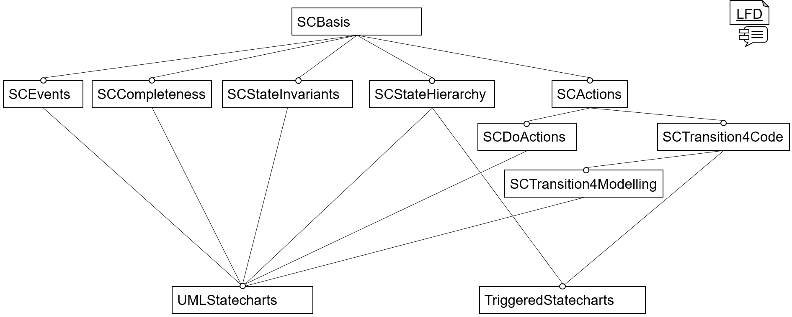

<!-- (c) https://github.com/MontiCore/monticore -->
[[_TOC_]]

# Statecharts

This project offers two variants of Statechart Languages [UMLStatecharts](UMLStatecharts.mc4) and 
[TriggeredStatecharts](TriggeredStatecharts.mc4) both of which are based on several provided 
language components that offer the different features for Statecharts. These components are:
- [SCBasis](SCBasis.mc4),
- [SCStateHierarchy](SCStateHierarchy.mc4),
- [SCStateInvariants](SCStateInvariants.mc4),
- [SCActions](SCActions.mc4),
- [SCDoActions](SCDoActions.mc4),
- [SCTransitions4Code](SCTransitions4Code.mc4),
- [SCTransitions4Modelling](SCTransitions4Modelling.mc4), and
- [SCCompleteness](SCCompleteness.mc4)

<div align="center">

<br><b>Figure 1:</b> 
Overview of the statecharts language components and their relations.
</div><br>


## Syntax

A small for the UML Statecharts language:

```
statechart Door {
  state Opened;
  initial state Closed;
  state Locked;

  Opened -> Closed  close() ;
  Closed -> Opened  open() / { count++; ringTheDoorBell(); };
  Closed -> Locked  timeOut() / lockDoor(); ;
  Locked -> Closed  [isAuthorized() && keyFits()] unlock() ;
}

```
This example models the three states of a door: `Opened`, `Closed`, and `Locked`
and four transitions (each terminated by `;`).
- States may be marked with `initial` and `final`.
- A transition is defined by `source -> target` states,
  a stimulus, such as a method call `close()`,
  a trigger condition `[...]`, and an action `/ ...`.
- Expressions can be used for conditions, and statements respectively blocks `{...}` 
  for the actions.

Further extensions are shown in the following, where 
`EngineRunning` has two substates as well as entry, exit actions and an invariant:
<a name="example2"></a>
``` 
statechart Car {
  initial state EngineOff;
  state EngineRunning {
    [!fuelIsEmpty]
    entry / {lightsOn();}
    initial state Parking;
    state Driving;
    exit / {lightsOff();}
  };
}
```

Expressions and statements can be taken from MontiCores basic grammar library 
and extended by any own interesting language constructs (such as sending/receiving 
messages `!m` or `?m`)

 ## UMLStatecharts

 This language combines the language components `SCActions`, `SCDoActions`, `SCStateHierarchy`, 
 `SCStateInvariants`, `SCCompleteness`, `SCTransitions4Modelling`, `CommonExpressions` and
 `MCCommonStatements`. Thus, it allows modeling UML-like Statechart with hierarchical states that 
 may have entry, do and exit actions as well as invariants. Furthermore, transitions with pre- 
 and postconditions, events and actions are possible. The  statechart itself as well as states 
 can be marked as complete. The teaser above conforms to this language.
 
 ## TriggeredStatecharts
 
 `TriggeredStatecharts` is a second combination of the basic language components. 
 It combines the 
 language components `SCActions`, `SCStateHierarchy`, `SCTransitions4Code`, `CommonExpressions` and 
 `MCCommonStatements`. Thus, it allows modeling Statecharts with hierarchical states that may 
 have entry and exit actions.
 
 On the one hand, `TriggeredStatecharts` show how flexible the language component library
 is and how easy individual languages can be designed.
 
 On the other hand, `TriggeredStatecharts` have their own dedicated use for descriptions
 in the embedded area, where a software component is often *triggered* 
 on a regular basis (i.e. with a certain periodic repetition and signals do not
 arrive as events, but as available values). We also designed `TriggeredStatecharts`
 as implementation oriented language, and therefore do not add specification oriented constructs:
 - no do actions 
 - no state invariants
 - transitions consist of a precondition, an event and an action, each of which is optional.

 
 ## SCBasis
`SCBasis` is the basic grammar component for automata. It defines
a Statechart structure including package 
and imports as well as the Statechart nonterminal itself. 
Inside a Statechart the `SCArtifact` extension point allows adding various forms
of states and transitions (or other constructs).
Furthermore, states and transitions 
with extension points for their bodies (`SCSBody` and `SCTBody`) are provided. 

 ## Hierarchical states
 This project provides two language components for hierarchical states: `SCStateHierarchy` and  
 `SCStateInvariants`. The language component `SCStateHierarchy` is based on the `SCBasis` language 
 component and adds a state body variant that allows nested state elements, i.e., states and transitions.
 The second language component `SCStateInvariants` extends `SCStateHierarchy` and additionally provides 
 invariants within states. The [second syntax example](#example2) contains an hierachical state 
 `EngineRunning` which has two substates `Parking` and `Driving` and an invariant `[!fuelIsEmpty]`.
 
 ## Actions
 
 ## Transitions
 
 <!-- TODO
 ## SCActions
 ## SCDoActions
 ## SCTransitions4Code
 ## SCTransitions4Modelling
 ## SCCompleteness
 -->

<!-- #### Handwritten Extensions -->

<!-- ### Symboltable -->


## Further Information

* [Project root: MontiCore @github](https://github.com/MontiCore/monticore)
* [MontiCore documentation](http://www.monticore.de/)

* [**List of languages**](https://git.rwth-aachen.de/monticore/monticore/-/blob/dev/docs/Languages.md)
* [**MontiCore Core Grammar Library**](https://git.rwth-aachen.de/monticore/monticore/blob/dev/monticore-grammar/src/main/grammars/de/monticore/Grammars.md)
* [Best Practices](https://git.rwth-aachen.de/monticore/monticore/-/blob/dev/docs/BestPractices.md)
* [Publications about MBSE and MontiCore](https://www.se-rwth.de/publications/)

* [Licence definition](https://github.com/MontiCore/monticore/blob/master/00.org/Licenses/LICENSE-MONTICORE-3-LEVEL.md)

